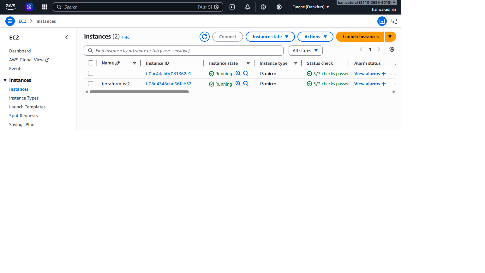

# Terraform AWS EC2 Lab

## Overview
This project provisions a basic AWS environment using Terraform.

It creates:
- an EC2 instance
- a Security Group allowing SSH access
- Terraform outputs for instance ID, public IP, and Security Group ID

## What I practiced
- configuring the AWS provider
- creating AWS resources with Terraform
- using a data source to fetch the latest Amazon Linux AMI
- attaching a Security Group to an EC2 instance
- using Terraform outputs
- reading Terraform state and resource details

## Terraform concepts used
- provider
- resource
- data
- output

## Resources created
- `aws_security_group.my_sg`
- `aws_instance.my_ec2`

## Outputs
- `instance_id`
- `public_ip`
- `security_group_id`

## Notes
This lab was built step by step to understand how Terraform manages AWS infrastructure as code in a practical way.
## Screenshot

